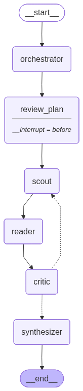

# Intelligent Research Assistant (Autonomous Research Studio)

An advanced multi-agent swarm that automates deep research workflows through complex reasoning, multi-hop web scraping, and human-in-the-loop plan execution.

## Overview

I built this platform to automate complex research workflows and make deep analysis accessible. Instead of a simple single shot query system, it acts as a persistent **Autonomous Research Studio** leveraging a multi-agent swarm. When given a request, an Orchestrator agent dynamically breaks down the problem into a sequential plan consisting of actionable sub-tasks. The system then automatically scouts for information using an omni search strategy, reads and scrapes web pages deeply, and actively critiques its own findings, looping back to search again if the gathered data is insufficient.

## Core Features & Capabilities

* **Multi-Agent Swarm Architecture:** The monolithic structure is broken down into persistent, specialized nodes (Orchestrator, Scout, Reader, Critic, Synthesizer) capable of deep, multi-hop reasoning.
* **Human-in-the-Loop (HITL) Execution:** The frontend features an interactive Research Plan data grid allowing users to review, edit, and approve the Orchestrator's execution strategy *before* any heavy scraping or API credits are consumed.
* **Omni-Search & Caching Strategy:** Integrates Wikipedia, ArXiv, and DuckDuckGo capabilities to prioritize high quality, free data sources, backed by an SQLite cache layer to instantly return data for repeated queries across sessions.
* **Dynamic ReAct Critic:** A Critic node evaluates gathered data against the original task, acting as a dynamic ReAct loop that automatically generates refined follow up queries if the data is insufficient.
* **Structured, Publication-Ready Output:** The Synthesizer agent gathers all structured intelligence and transforms it into a beautifully formatted Markdown report with an Executive Summary and strict, verifiable source citations.
* **Progressive Web App (PWA) Frontend:** The refined Gradio interface provides a modern, responsive, and application like experience. The UI features custom rounded components, a carefully crafted theme, and an optimized reading layout.

## Technology Stack

This project leverages a modern, highly optimized technology stack:

* **LangGraph:** Orchestrates our multi-step agentic workflows, branching logic, and runtime state management.
* **LangSmith:** Provides deep transparency, debugging, and evaluation metrics into the agent's internal reasoning traces.
* **FastAPI & Pydantic:** Powers the robust, type-checked backend REST API for processing query requests.
* **Gradio:** Drives the user-facing web interface and seamless Progressive Web App (PWA) functionality.
* **LM Studio:** Powers local LLM integration for privacy first natural language understanding and generation, bypassing the need for external APIs. Smart resource usage with 'Just in time' model loading.
* **BeautifulSoup4 & Requests:** Drives external web-scraping and internal HTTP communication.
* **Python & UV:** The foundation of the system, utilizing standard Python built securely and quickly with the UV package manager.
* **Docker:** Facilitates system-agnostic reproducibility and streamlined deployment.

## System Architecture

```text
                       ┌───────────────────────────┐
                       │   User Query (Gradio UI)  │
                       └─────────────┬─────────────┘
                                     │
                                     ▼
                       ┌───────────────────────────┐
                       │   Orchestrator Node       │
                       │   (Creates Research Plan, │
                       │    breaks into tasks)     │
                       └─────────────┬─────────────┘
                                     │
                                     ▼
                       ┌───────────────────────────┐
                       │Human-In-The-Loop Approval │
                       │(Review, edit, or approve  │
                       │ the generated plan in UI) │
                       └─────────────┬─────────────┘
                                     │
                                     ▼
                       ┌───────────────────────────┐
                       │   Scout Node              │◄───┐
                       │   (Executes searches via  │    │
                       │    cache/omni-search)     │    │
                       └─────────────┬─────────────┘    │
                                     │                  │
                                     ▼                  │
                       ┌───────────────────────────┐    │
                       │   Reader Node             │    │
                       │   (Deep web scraping and  │    │
                       │    content extraction)    │    │
                       └─────────────┬─────────────┘    │
                                     │                  │
                                     ▼                  │
                       ┌───────────────────────────┐    │
                       │   Critic Node             │    │
                       │   (Evaluates findings;    │────┘
                       │    loops back if lacking) │(Refined Queries)
                       └─────────────┬─────────────┘
                                     │ (Passed all checks)
                                     ▼
                       ┌───────────────────────────┐
                       │   Synthesizer Node        │
                       │   (Generates citations,   │
                       │    Markdown report)       │
                       └─────────────┬─────────────┘
                                     │
                                     ▼
                       ┌───────────────────────────┐
                       │   Gradio Frontend Report  │
                       │   (Executive summary and  │
                       │    final output rendered) │
                       └───────────────────────────┘
```

### Workflow Graph (LangGraph)



## Getting Started

### Prerequisites

* Python 3.13+ installed
* [uv](https://github.com/astral-sh/uv) package manager installed
* Docker & Docker Compose (if using containerized deployment)
* Tavily API Key
* Local LM Studio instance running

### 1. How to run locally

First, clone the repository and navigate into the directory:

```bash
git clone <repository-url>
cd Intelligent-Research-Assistant
```

Setup your environment variables by copying `example.env` to `.env`:

```bash
cp example.env .env
```
Ensure you add your `TAVILY_API_KEY` inside `.env`. Provide your Langsmith flags if you are leveraging them as well.

Next, install the required dependencies using the `uv` package manager:

```bash
uv sync
```

**Run the Backend:**
Start the backend server. It will listen on port `8000`.

```bash
uv run uvicorn backend.main:app --host 0.0.0.0 --port 8000 --reload
```

**Run the Frontend:**
In a separate terminal window, start the Gradio frontend application. It will run on port `7860`.

```bash
uv run python frontend/app.py
```

Access the frontend via your browser at `http://127.0.0.1:7860`.

### 2a. How to deploy on Docker

If you prefer to deploy the services individually using Docker, you can build and run them utilizing their respective `Dockerfile`s.

**Backend Build & Run:**
Ensure you are in the project's root directory so that docker context is correct.

```bash
docker build -t intelligent-research-backend -f backend/Dockerfile .

# Run the container locally, exposing it on 8000 and passing in your .env variables
docker run -d -p 8000:8000 --name backend-service --env-file .env intelligent-research-backend
```

**Frontend Build & Run:**
Navigate into the frontend directory to build the frontend.

```bash
cd frontend
docker build -t intelligent-research-frontend .
cd ..

# Run the frontend container
# Pass the correct API_URL if backend address is different
docker run -d -p 7860:7860 --name frontend-service -e API_URL=http://<host.docker.internal_or_backend_ip>:8000/query intelligent-research-frontend
```

### 2b. How to deploy using Docker Compose

Docker Compose is the most straightforward mechanism to spin up the entire environment together.

Inside the root directory, simply run:

```bash
docker-compose up --build -d
```

Running this command will automatically:
1. Build both the `frontend` and `backend` images.
2. Link them together seamlessly within a local docker network.
3. Handle environment variable exposure using `.env`.
4. Deploy the Application UI at `http://localhost:7860`.

To safely stop and remove the containers once you're done, run:

```bash
docker-compose down
```

## Future Improvements & Roadmap

To further elevate this Intelligent Research Assistant and deliver unparalleled value, the following features are planned:
- **Visual Graph & Agent Tracing**: An upcoming UI sidebar that visually displays real-time agent "thinking" and tracks how LangGraph execution graphs are traversed natively in the browser.
- **Multi-Agent Debates**: Implementing a reviewer/supervisor agent that debates and critiques the primary agent's findings to ensure maximum rigor.
- **Deep Persistent Memory**: Allowing the system to remember insights from past queries to build a personalized knowledge graph over time.
- **Multimodal Extraction**: Enabling the system to process not just text, but also images, charts, and diagrams from PDFs or web pages during its fact checking and summarization phases.
- **Interactive Citation Networks**: Providing a visual graph where users can click on citations to immediately see how sources interlink.
